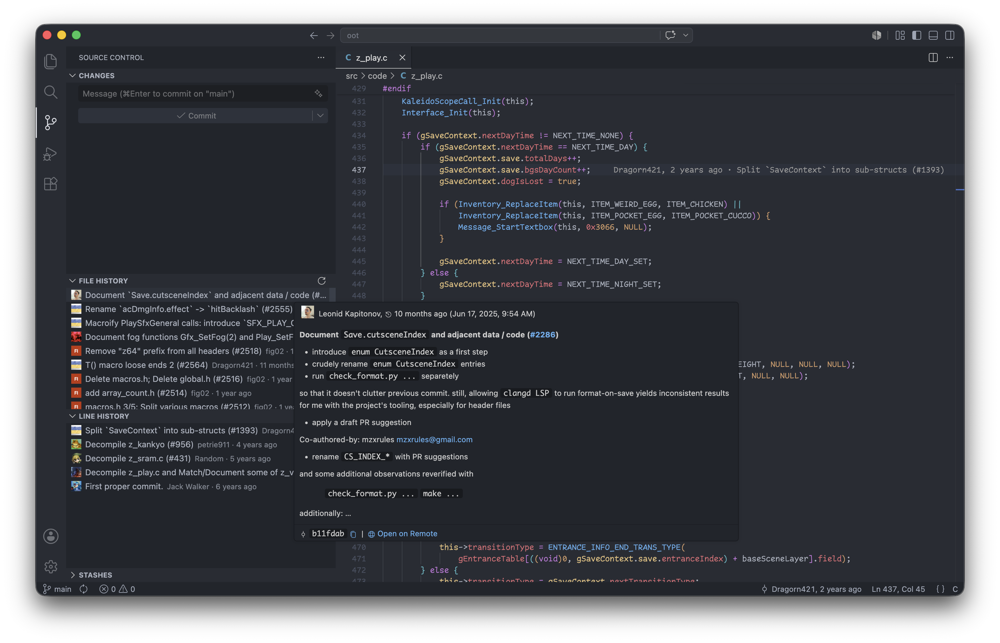

# Recall

Minimal VS Code extension that adds extra Git functionality.

- **File history**: commits touching the currently open file
- **Line history**: commits touching the currently selected line range
- **Stashes**: expandable list of stashes with per-file diffs and right-click **Apply / Pop / Drop** actions. **"Stash changes"** action when selecting files in the "Changes" panel.

	

